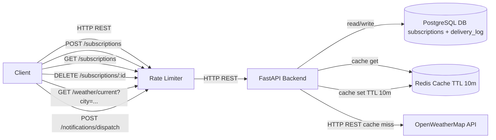

# Отчет по Практике 2: Капусткин Никита

## 1. Анализ промптов R.C.T.F.

### Задание 1 — Архитектура v2.0 (Mermaid)
**Role:** Senior Backend Architect / DevOps Architect
**Context:** Проект WeatherService — REST API сервис уведомлений о погоде.
v1.0 схема была упрощенной: Client → FastAPI Backend → PostgreSQL + OpenWeatherMap.
Нужно улучшить до v2.0: добавить Redis для кэширования погоды (TTL 10 минут) и Rate Limiter на входе API.
Ограничение: один сервис, без микросервисов;
важна читаемость и корректный синтаксис Mermaid (должно компилироваться в mermaid.live).
**Task:** Сгенерировать Mermaid диаграмму компонентов v2.0 и отразить:
1) компоненты: Client, FastAPI Backend, PostgreSQL (subscriptions + delivery_log), Redis Cache (кэш текущей погоды), OpenWeatherMap API, Rate Limiter (на входе API);
2) основные связи и протоколы на ребрах (HTTP/REST);
3) cache-aside: Backend сначала читает Redis; при miss запрашивает OpenWeatherMap, затем пишет в Redis с TTL 10 минут;
4) ключевые эндпоинты v1.0, которые видит клиент:
   - POST /subscriptions
   - GET /subscriptions
   - DELETE /subscriptions/{id}
   - GET /weather/current?city=...
   - POST /notifications/dispatch
5) Backend читает/пишет данные подписок и логов в PostgreSQL;
6) Rate Limiter стоит перед Backend и ограничивает входящие запросы клиента.
**Format:** Вернуть ТОЛЬКО Mermaid-код в блоке ```mermaid без дополнительного текста.
Использовать flowchart LR (или flowchart TB), без фигурных скобок {} в узлах.
Для сервисов использовать [Name], для хранилищ (Name).
На ребрах указать протокол и/или действие (например |HTTP REST|, |read/write|, |cache get/set (TTL 10m)|).
Диаграмма должна компилироваться в mermaid.live без правок.
**Результат:** Получил рабочую Mermaid-схему v2.0 с Redis (TTL 10m) и Rate Limiter,
указал протоколы и показал cache-aside.
Так как Mermaid-парсер не принимает фигурные скобки в подписях (например /{id}) и скобки в label ребра,
в итоговой схеме заменил DELETE /subscriptions/{id} на DELETE /subscriptions/:id и использовал
подпись ребра без скобок ("HTTP REST cache miss").
---
### Задание 2 — Gherkin (Acceptance Criteria) по User Story
**Role:** Опытный QA Automation Engineer (BDD/Gherkin) для REST API
**Context:** User Story из прошлого отчёта: подписка на уведомления по выбранному городу.
Технический контекст: REST API на FastAPI; OpenWeatherMap; PostgreSQL (подписки);
Redis (кэш погоды TTL 10 минут); идентификация через заголовок X-User-Id.
**Task:** Написать детальные Acceptance Criteria в строгом Gherkin-синтаксисе (Given/When/Then) для User Story
про подписку на уведомления.
Минимум 5 сценариев: 2 позитивных, 2 негативных (несуществующий город, дубликат подписки),
1 граничный (город с пробелами/спецсимволами).
**Format:** Вернуть только Gherkin-код.
Каждый сценарий начинается с 'Scenario:' и содержит Given/When/Then/And.
В шагах указать метод/путь, заголовки и короткие JSON-примеры там, где нужно.
**Результат:** Сформировал набор Gherkin-сценариев для POST /subscriptions:
happy path, нормализация city, дубликат подписки (409), несуществующий город (404)
и деградация при недоступности провайдера (503).
---
### Задание 3 — DoR v2.0
**Role:** Опытный Product Owner с 5-летним опытом в Agile/Scrum
**Context:** Мы разрабатываем WeatherService — REST API для уведомлений о погоде.
DoR v1.0: цель и ожидаемый результат; критерии приемки и edge cases; зависимости/риски и план ошибок;
контракты/интерфейсы; нефункциональные требования (SLO/лимиты/безопасность/логи/метрики);
план тестирования и способ верификации.
Проблемы v1.0: слишком общий, нет структуры по категориям, нет специфики для REST API.
**Task:** Создать улучшенную версию Definition of Ready v2.0 для задач WeatherService.
**Format:** Структурированный чек-лист в Markdown с категориями Requirements, Technical, Design, Testing, Documentation.
Каждая категория содержит 3–5 конкретных пунктов.
**Результат:** Сформировал DoR v2.0: 5 категорий, пункты конкретные и проверяемые для REST API WeatherService (контракты, риски, NFR, тестирование, документация).
---
### Задание 3 — DoD v2.0
**Role:** Опытный Scrum Master с опытом в DevOps и CI/CD
**Context:** Мы разрабатываем WeatherService — REST API для уведомлений о погоде.
DoD v1.0 включал: функциональность по AC, контракт API и валидацию, коды ответов и ошибки,
идемпотентность (где требуется), таймауты/ретраи/деградацию, тесты, миграции, логирование,
качество кода, документацию и smoke‑проверку.
Проблемы v1.0: недостаточно деталей, нет структуры, нет специфики для REST API.
**Task:** Создать улучшенную версию Definition of Done v2.0 для задач WeatherService (REST API).
**Format:** Структурированный чек-лист в Markdown с категориями Code, Tests, Documentation, Review, Deployment.
Каждая категория содержит 3–5 конкретных пунктов.
**Результат:** Сформировал DoD v2.0: структурировал по 5 категориям, добавил проверяемые пункты для REST API (контракты/коды/ошибки провайдера, тесты, миграции, логи, выпуск).
---
### Задание 4 — План тестирования v2.0
**Role:** Test Lead с 10+ лет опыта в тестировании Python REST API (FastAPI) и интеграций с внешними сервисами
**Context:** User Story: подписка на уведомления по выбранному городу, чтобы получать актуальную погоду без ручной проверки.
Контекст: Backend FastAPI; OpenWeatherMap (5xx/429/таймауты); PostgreSQL (subscriptions, delivery_log,
уникальность по (X-User-Id, city_normalized)); Redis (TTL 10 минут, cache-aside); rate limiting на входе;
идентификация через заголовок X-User-Id.
**Task:** Составить детальный тест‑план для фичи подписки, структурированный по пирамиде тестирования
(Unit/Integration/E2E), с покрытием позитивных, негативных, граничных и конкурентных сценариев.
**Format:** Markdown-таблица: | ID | Тип | Компонент | Описание | Предусловия | Шаги | Ожидаемый результат |.
Минимум 12 тест-кейсов, распределение ~50% unit, ~30% integration, ~20% e2e;
ID формата TC-001; Тип строго Unit/Integration/E2E.
**Результат:** Сформировал тест‑план на 15 кейсов (7 Unit, 5 Integration, 3 E2E) с явными предусловиями, шагами и
ожидаемыми результатами.
Покрыл: валидацию, граничные значения city, дубликаты, ошибки OpenWeatherMap
(404/429/5xx/timeout), кэш Redis (TTL 10m), конкурентность и rate limiting.
---
### Задание 5 — Functional Delivery v2.0 (Jira-тикеты)
**Role:** Senior Delivery Manager / Engineering Manager (Agile, backend delivery, качество)
**Context:** WeatherService — REST API сервис уведомлений о погоде.
Стек: FastAPI, PostgreSQL (subscriptions, delivery_log), OpenWeatherMap (5xx/429/timeout),
Redis (TTL 10 минут, cache-aside), rate limiting, идентификация через X-User-Id.
Базовые тикеты из Практики 1: WS-3 (POST /subscriptions), WS-6 (OpenWeatherMap client),
WS-7 (GET /weather/current), WS-8 (POST /notifications/dispatch + идемпотентность).
**Task:** Улучшить 4 тикета (WS-3/WS-6/WS-7/WS-8) до уровня 'готово брать в спринт':
переписать Description (включая out-of-scope),
добавить детальные Acceptance Criteria в формате Given/When/Then,
добавить детальные test cases с проверками ответов/БД/логов,
указать Dependencies, Priority и Estimate.
**Format:** Markdown.
На каждый тикет отдельный блок со строгими полями:
Title, Description, Acceptance Criteria (Given/When/Then), Test Cases, Dependencies, Priority, Estimate.
**Результат:** Сформировал 4 улучшенных Jira-тикета (WS-3/WS-6/WS-7/WS-8) с конкретными AC (G/W/T),
детальными тест-кейсами, зависимостями, приоритетами и оценками;
учёл X-User-Id, уникальность подписки, ошибки OpenWeatherMap (5xx/429/timeout),
Redis TTL=10m, cache-aside и идемпотентность dispatch.
---
### Домашнее задание (опционально) — Event Storming v2.0
**Role:** Event Storming Facilitator / Domain-Driven Design (DDD) консультант
**Context:** WeatherService — REST API сервис уведомлений о погоде.
Функциональность v1.0: POST/GET/DELETE /subscriptions, GET /weather/current?city=...,
POST /notifications/dispatch.
Технический контекст: FastAPI backend, PostgreSQL (subscriptions, delivery_log),
Redis (кэш погоды TTL 10 минут, cache-aside), OpenWeatherMap (возможны 5xx/429/timeout),
идентификация через X-User-Id, rate limiting на входе.
**Task:** Сгенерировать улучшенный Event Storming v2.0: описать акторов и внешние системы,
дать список domain events (≥12) для подписок, текущей погоды (Redis cache-aside), dispatch и delivery_log,
обработки ошибок провайдера и rate limiting.
Для каждого события указать triggering command, actor, reads/writes (subscriptions/delivery_log/Redis)
и ключевое правило (уникальность, anti-IDOR, TTL и т. д.).
Также описать политики: cache-aside, маппинг ошибок OpenWeatherMap, идемпотентность dispatch, anti-IDOR.
**Format:** Только Markdown со структурой: Actors, External Systems, Commands, Domain Events (таблица), Policies.
Текст на русском, а имена эндпоинтов/полей/таблиц и HTTP-коды — на английском.
**Результат:** Подготовил Event Storming v2.0: акторы/системы/команды, таблицу событий для подписок,
кэша погоды и dispatch (включая обработку 429/5xx/timeout и rate limiting),
а также политики cache-aside, error mapping, idempotency dispatch и anti-IDOR
для DELETE /subscriptions/:id.
---
### Домашнее задание (опционально) — Roadmap v2.0
**Role:** Product Manager / Technical Program Manager (backend, REST API)
**Context:** WeatherService — REST API сервис уведомлений о погоде.
Текущая функциональность v1.0: POST/GET/DELETE /subscriptions, GET /weather/current?city=...,
POST /notifications/dispatch.
Технический контекст: FastAPI, PostgreSQL (subscriptions, delivery_log),
Redis (TTL 10 минут, cache-aside), OpenWeatherMap (5xx/429/timeout), X-User-Id, rate limiting.
Цель: довести прототип до продакшен-готовности без микросервисов.
**Task:** Сформировать Roadmap v2.0 по версиям (≥4), для каждой версии указать Goals, Scope, Non-goals,
Risks/Dependencies и Success Metrics с измеримыми порогами.
Включить темы: observability, надежность интеграции с OpenWeatherMap, безопасность
(anti-IDOR, no secrets in logs), производительность (Redis TTL 10m, rate limiting)
и качество (unit/integration/e2e + smoke).
**Format:** Только Markdown: заголовок “Roadmap v2.0”, далее версии vX.Y с секциями
Goals/Scope/Non-goals/Risks/Dependencies/Success Metrics.
Текст на русском, а имена эндпоинтов/таблиц/метрик/HTTP-кодов — на английском.
**Результат:** Подготовил Roadmap v2.0 по версиям v1.1/v1.2/v2.0/v2.1 с конкретным scope и измеримыми метриками успеха
(latency p95, error-rate, cache_hit_rate, снижение вызовов OpenWeatherMap, CI stability, smoke-time),
а также явными non-goals и рисками.
---
### Домашнее задание — Шаг 1 — Схема БД (users/subscriptions)
**Role:** Senior Database Architect (PostgreSQL)
**Context:** Chain of Thought для слоя данных WeatherService.
Контекст: REST API подписок (POST/GET/DELETE /subscriptions) с идентификацией по заголовку X-User-Id;
подписки хранятся в PostgreSQL, погоду в БД не храним (она кэшируется в Redis TTL 10 минут).
Требование: подписка уникальна для пользователя по (user_id, city_normalized),
где city_normalized = lower(trim(city)).
**Task:** Спроектировать концепт схемы PostgreSQL для таблиц users и subscriptions: поля/типы, связи,
ограничения (PK/FK/NOT NULL/UNIQUE) и индексы под основные запросы
(список подписок и удаление с проверкой принадлежности).
**Format:** Markdown с разделами Assumptions, users, subscriptions, Constraints & Indexes.
Без SQL DDL и без добавления третьих таблиц.
**Результат:** Сформировал концепт: users(user_id TEXT PK из X-User-Id, created_at),
subscriptions(id BIGSERIAL PK, user_id FK, city, city_normalized, channel='email', recipient, created_at),
UNIQUE(user_id, city_normalized) и индексы под GET/DELETE.
---
### Домашнее задание — Шаг 2 — Pydantic модели (FastAPI)
**Role:** Senior Python Backend Engineer (FastAPI) / API Designer
**Context:** Продолжение Chain of Thought: после концепта БД нужно описать Pydantic-модели для REST API подписок.
Контекст: FastAPI, идентификация пользователя через X-User-Id, уникальность (user_id, city_normalized),
валидация city/recipient/channel на уровне API; city_normalized вычисляется как lower(trim(city)).
**Task:** Описать Pydantic-модели (request/response) для POST /subscriptions, GET /subscriptions
и DELETE /subscriptions/:id, а также правила валидации/нормализации
(city trim + not empty + max 100, channel только 'email', recipient как email,
X-User-Id обязателен и длина ограничена).
**Format:** Markdown: раздел Pydantic Models с одним блоком ```python, раздел Validation & Normalization Rules
и раздел Examples.
В начале указать версию Pydantic (v1 или v2) и не смешивать синтаксис.
**Результат:** Сформировал Pydantic v2 модели для subscriptions, включая валидацию city/recipient/channel,
валидацию заголовка X-User-Id через Header(alias='X-User-Id') и правило вычисления city_normalized.
---
### Домашнее задание — Шаг 3 — SQL DDL (PostgreSQL)
**Role:** Senior Database Architect (PostgreSQL) / Backend Engineer
**Context:** Финальный шаг Chain of Thought: на основе концепта схемы и правил валидации нужно подготовить DDL.
Ограничения: только таблицы users и subscriptions; idempotent DDL;
без триггеров/функций/extensions; city_normalized заполняется приложением.
**Task:** Сгенерировать idempotent SQL DDL для PostgreSQL: CREATE TABLE IF NOT EXISTS для users/subscriptions,
PK/FK/UNIQUE, минимальные CHECK под требования валидации (user_id len, city trim/len, channel='email',
простая проверка recipient), а также индексы под GET/DELETE.
**Format:** Один самодостаточный SQL-блок в ```sql, который выполняется на пустой базе.
**Результат:** Сформировал DDL с CREATE TABLE IF NOT EXISTS, PK/FK/UNIQUE, CHECK-ограничениями и индексами
subscriptions(user_id, created_at DESC) и subscriptions(user_id, id).
---
## 2. Улучшенные артефакты

### Mermaid v2


### Gherkin Scenarios
```gherkin

Feature: Подписка на уведомления по городу через API

  Scenario: Успешная подписка на существующий город
    Given API доступен
    And заголовок "X-User-Id" равен "user-a"
    And заголовок "Content-Type" равен "application/json"
    And пользователь "user-a" еще не подписан на город "Moscow"
    When клиент отправляет POST "/subscriptions" с телом:
      """
      {"city":"Moscow","recipient":"user@example.com","channel":"email"}
      """
    Then API проверяет существование города "Moscow" через OpenWeatherMap API
    And API сохраняет подписку в PostgreSQL
    And API возвращает статус 201
    And ответ содержит поля "id", "city", "recipient", "channel", "created_at"
    And данные о погоде для "Moscow" кэшируются в Redis на 10 минут

  Scenario: Успешная подписка на город с пробелами и спецсимволами (нормализация city)
    Given API доступен
    And заголовок "X-User-Id" равен "user-a"
    And заголовок "Content-Type" равен "application/json"
    And пользователь "user-a" еще не подписан на город "St. Petersburg"
    When клиент отправляет POST "/subscriptions" с телом:
      """
      {"city":"  St. Petersburg  ","recipient":"user@example.com","channel":"email"}
      """
    Then API нормализует поле "city" (обрезает пробелы по краям)
    And API проверяет существование города "St. Petersburg" через OpenWeatherMap API
    And API сохраняет подписку в PostgreSQL
    And API возвращает статус 201
    And ответ содержит поле "city" равное "St. Petersburg"

  Scenario: Повторный запрос на подписку на тот же город возвращает конфликт (дубликат)
    Given API доступен
    And заголовок "X-User-Id" равен "user-a"
    And заголовок "Content-Type" равен "application/json"
    And в PostgreSQL уже есть подписка пользователя "user-a" на город "Moscow"
    When клиент отправляет POST "/subscriptions" с телом:
      """
      {"city":"Moscow","recipient":"user@example.com","channel":"email"}
      """
    Then API возвращает статус 409
    And в PostgreSQL по-прежнему ровно одна подписка пользователя "user-a" на город "Moscow"

  Scenario: Подписка на несуществующий город отклоняется
    Given API доступен
    And заголовок "X-User-Id" равен "user-a"
    And заголовок "Content-Type" равен "application/json"
    When клиент отправляет POST "/subscriptions" с телом:
      """
      {"city":"NoSuchCity","recipient":"user@example.com","channel":"email"}
      """
    Then API проверяет существование города "NoSuchCity" через OpenWeatherMap API
    And API возвращает статус 404
    And в PostgreSQL не создается подписка пользователя "user-a" на город "NoSuchCity"

  Scenario: При недоступности OpenWeatherMap подписка не создается и возвращается контролируемая ошибка
    Given API доступен
    And заголовок "X-User-Id" равен "user-a"
    And заголовок "Content-Type" равен "application/json"
    And OpenWeatherMap API недоступен или возвращает ошибку
    When клиент отправляет POST "/subscriptions" с телом:
      """
      {"city":"Moscow","recipient":"user@example.com","channel":"email"}
      """
    Then API возвращает статус 503
    And в PostgreSQL не создается подписка пользователя "user-a" на город "Moscow"

```

### DoR v2.0

## DoR v2.0

### Requirements
- [ ] Сформулирована цель задачи и пользовательская ценность (что меняется для пользователя/сервиса).
- [ ] Определены критерии приемки (минимум happy path + негативные сценарии) в формате Given/When/Then или списком проверок.
- [ ] Перечислены edge cases, включая: дубликат подписки, битый JSON, пустой/слишком длинный `city`, попытка IDOR при `DELETE /subscriptions/:id`.
- [ ] Определены ожидаемые HTTP статусы для успеха и основных ошибок (2xx/4xx/5xx) и правила маппинга ошибок.

### Technical
- [ ] Подтверждены зависимости и доступы: PostgreSQL, Redis, OpenWeatherMap (ключи/ENV), а также сетевые настройки/доступность.
- [ ] Зафиксированы таймауты и поведение при сбоях OpenWeatherMap (5xx, 429, timeout) без ретрай‑шторма.
- [ ] Описана стратегия кэширования Redis (cache-aside), ключи кэша и TTL=10 минут, что именно кэшируется и когда обновляется.
- [ ] Определены требования к rate limiting на входе API (по чему лимитируем и какой ожидаемый эффект).

### Design
- [ ] Зафиксирован контракт API: метод/путь/параметры/заголовки (включая `X-User-Id`) и схемы JSON (request/response).
- [ ] Описана валидация и нормализация входа (например, `city` trim/lower, `recipient` формат, `channel` допустимые значения).
- [ ] Определены правила целостности данных: уникальность подписки (например `(X-User-Id, city_normalized)`), конфликт → 409, отсутствие дублей.
- [ ] Описаны правила безопасности: пользователь не может читать/удалять чужие подписки; безопасное поведение при ошибках (не раскрывать чужие данные).

### Testing
- [ ] Есть план тестирования по уровням (unit/integration/e2e) для фичи/задачи.
- [ ] Определено, что мокается: ответы OpenWeatherMap (429/5xx/timeout) и сценарии cache hit/miss для Redis.
- [ ] Определены проверки БД: что должно появиться/не появиться в `subscriptions` и `delivery_log`.
- [ ] Описан способ ручной верификации (smoke) с конкретными запросами (curl/Postman) и ожидаемыми статусами.

### Documentation
- [ ] Обновления документации перечислены: README/env vars (PostgreSQL/Redis/OpenWeatherMap), примеры запросов/ответов.
- [ ] Определен единый формат ошибок API (структура ответа и поля) и он согласован для реализации/тестов.
- [ ] Уточнены требования к логированию: какие события пишем и какие данные запрещены в логах (секреты/ключи/токены/PII).


### DoD v2.0

## DoD v2.0

### Code
- [ ] Реализованы все пункты AC задачи без «частично».
- [ ] Контракт API соблюден: метод/путь/параметры/заголовки/тело/статусы соответствуют спецификации.
- [ ] Валидация входных данных настроена (Pydantic), битый JSON обрабатывается корректно (400/422 по контракту).
- [ ] Ошибки OpenWeatherMap (5xx/429/timeout) обрабатываются без падения сервиса, возвращается контролируемый ответ.

### Tests
- [ ] Добавлены тесты: happy path + негативные (валидация, дубликаты, несуществующие сущности, ошибки провайдера).
- [ ] Есть интеграционные тесты с PostgreSQL (миграции, уникальность, CRUD подписок).
- [ ] Внешний Weather API замокан/стабилизирован, тесты детерминированы и не зависят от сети.
- [ ] Все тесты проходят локально и в CI без флапов.

### Documentation
- [ ] Обновлены примеры запросов/ответов для затронутых эндпоинтов и коды ошибок.
- [ ] Обновлены инструкции запуска (env vars, ключи OpenWeatherMap, как поднять БД/кэш при необходимости).
- [ ] Обновлена документация API (OpenAPI/Swagger), если она используется в проекте.

### Review
- [ ] Код отформатирован, линтер/типизация (если используются) без ошибок.
- [ ] Нет закомментированного «мусора» и временных хаков без явных TODO/ссылок на задачу.
- [ ] Проведено код‑ревью, замечания закрыты или зафиксированы как follow‑up.

### Deployment
- [ ] Если менялась схема БД: миграции добавлены и применяются на чистой базе.
- [ ] Логи ключевых событий настроены (входящие запросы, ошибки валидации, ошибки провайдера, результат dispatch) без утечки секретов.
- [ ] Выполнен smoke‑сценарий (curl/Postman) и результат зафиксирован.


### Test Plan v2

| ID | Тип | Компонент | Описание | Предусловия | Шаги | Ожидаемый результат |
|---|---|---|---|---|---|---|
| TC-001 | Unit | Validation layer | Нормализация `city`: trim + lower для `city_normalized` | Доступны функции/валидаторы нормализации `city` | Вызвать нормализацию для `city="  Moscow  "` и `city="St. Petersburg"` | `city` обрезан по краям; `city_normalized` равен `moscow` и `st. petersburg` соответственно |
| TC-002 | Unit | Validation layer | Валидация `city`: пустое значение | Доступны Pydantic‑модели/валидаторы запроса | Создать request-модель для `POST /subscriptions` с `city=""` (и/или `"   "`), остальное валидно | Ошибка валидации (ожидаемое поведение: 422 на уровне API) |
| TC-003 | Unit | Validation layer | Валидация `city`: слишком длинное значение (>100) | Доступны Pydantic‑модели/валидаторы запроса | Создать request-модель с `city="<строка из 101 символа>"`, остальное валидно | Ошибка валидации (ожидаемое поведение: 422 на уровне API) |
| TC-004 | Unit | Validation layer | Валидация `recipient`: не email | Доступны Pydantic‑модели/валидаторы запроса | Создать request-модель с `recipient="userexample.com"` или `recipient="user@"`, остальное валидно | Ошибка валидации (ожидаемое поведение: 422 на уровне API) |
| TC-005 | Unit | Validation layer | Валидация `channel`: недопустимое значение | Доступны Pydantic‑модели/валидаторы запроса | Создать request-модель с `channel="sms"` (или `"telegram"`), остальное валидно | Ошибка валидации (ожидаемое поведение: 422 на уровне API) |
| TC-006 | Unit | Redis cache service | Установка TTL=10 минут и формат ключа кэша | Redis cache service выделен в модуль и умеет `get/set` c TTL | Записать в кэш погоду для `city_normalized="moscow"`; прочитать TTL ключа | Ключ создан по принятому шаблону; TTL установлен ~600 секунд; чтение возвращает записанные данные |
| TC-007 | Unit | Weather API client | Маппинг ошибок OpenWeatherMap на доменные ошибки клиента | Weather API client тестируется с моками HTTP ответов | Смоделировать ответы провайдера: 404, 429, 500, timeout; вызвать метод получения погоды | 404 → ошибка “город не найден”; 429/500/timeout → ошибка провайдера (для сервиса это контролируемая 503); нет “успеха” при пустом/ошибочном ответе |
| TC-008 | Integration | Database layer | Миграции и уникальность подписки по `(X-User-Id, city_normalized)` | Поднят PostgreSQL (testcontainers), применены миграции | 1) Вставить подписку user-a + city_normalized=moscow; 2) повторить вставку с теми же значениями | Вторая вставка завершается конфликтом уникальности; в таблице ровно 1 запись |
| TC-009 | Integration | REST API endpoints | `POST /subscriptions` (happy path): создаёт подписку, пишет в БД, кэширует погоду | Подняты PostgreSQL и Redis; OpenWeatherMap замокан на 200 | Отправить `POST /subscriptions` с заголовками `X-User-Id: user-a`, `Content-Type: application/json`, телом `{"city":"Moscow","recipient":"user@example.com","channel":"email"}` | HTTP 201; ответ содержит `id`; в `subscriptions` создана запись; в Redis появился кэш погоды (TTL 10m); провайдер вызван 1 раз при cache miss |
| TC-010 | Integration | REST API endpoints | `POST /subscriptions`: битый JSON не создаёт подписку | Подняты PostgreSQL и Redis | Отправить `POST /subscriptions` с `X-User-Id: user-a`, `Content-Type: application/json`, телом `{"city":"Moscow"` | HTTP 400; записи в `subscriptions` нет; кэш в Redis не создаётся |
| TC-011 | Integration | REST API endpoints | Дубликат подписки: повторный `POST /subscriptions` возвращает 409 | Подняты PostgreSQL и Redis; OpenWeatherMap замокан на 200; подписка уже есть | 1) Выполнить успешный `POST /subscriptions` для user-a+Moscow; 2) повторить тот же `POST /subscriptions` | Второй запрос возвращает 409; в БД по-прежнему 1 подписка для user-a+Moscow |
| TC-012 | Integration | REST API endpoints + Weather API client | Ошибки провайдера при создании подписки | Подняты PostgreSQL и Redis; OpenWeatherMap замокан по кейсам | Параметризованный тест: (A) провайдер 404 для `city=NoSuchCity`; (B) 429; (C) 500; (D) timeout; отправить `POST /subscriptions` | (A) HTTP 404; (B/C/D) HTTP 503; во всех случаях в БД нет новой подписки; кэш в Redis не создан; нет зависаний/бесконечных ретраев |
| TC-013 | E2E | REST API endpoints | E2E: создать подписку → проверить списком → удалить → проверить списком | Запущен сервис целиком; подключены PostgreSQL и Redis; OpenWeatherMap доступен через стаб/мок | 1) `POST /subscriptions` (X-User-Id: user-a); 2) `GET /subscriptions` (user-a) и проверить наличие `id`; 3) `DELETE /subscriptions/:id` (user-a); 4) повторить `GET /subscriptions` | 201 → 200 → 204 (или 200) → 200; подписка появляется и затем исчезает из списка |
| TC-014 | E2E | Weather API client + REST API endpoints | E2E: деградация при таймауте OpenWeatherMap на подписке | Запущен сервис; OpenWeatherMap стаб/мок настроен на timeout | Отправить `POST /subscriptions` для `city=Moscow` (X-User-Id: user-a) при таймауте провайдера | HTTP 503; подписка не создаётся; сервис отвечает быстро (в пределах таймаута), без “подвисания” |
| TC-015 | E2E | Rate Limiter | E2E: rate limiting защищает `POST /subscriptions` | Запущен сервис; включён rate limiting; PostgreSQL доступен | Отправить серию `POST /subscriptions` (например 20 запросов за короткий интервал) с `X-User-Id: user-a` | Часть запросов получает 429 от rate limiter; сервис остаётся доступным; в БД число записей соответствует числу успешных 201 (без неожиданных дублей) |


### Functional Delivery v2.0

### WS-3
- Title: WS-3 — POST /subscriptions (создание подписки) + валидация + уникальность
- Description: Реализовать `POST /subscriptions`, который создаёт подписку пользователя на город. Пользователь определяется по заголовку `X-User-Id`. Тело запроса: `city`, `recipient`, `channel` (допустимые значения, например `"email"`). Сервис нормализует `city` (trim) и вычисляет `city_normalized = lower(trim(city))`, сохраняет запись в PostgreSQL (таблица `subscriptions`) и возвращает `201 Created` с данными подписки (`id`, `city`, `city_normalized`, `recipient`, `channel`, `created_at`). Обработать ошибки и гонки так, чтобы не было 500. Out of scope: полноценная авторизация, рассылка уведомлений, dispatch, настройки частоты/порогов, валидация существования города через OpenWeatherMap (это отдельные фичи).
- Acceptance Criteria (Given/When/Then):
  - Given задан `X-User-Id` и валидный JSON `{city, recipient, channel}`, When клиент отправляет `POST /subscriptions`, Then сервис возвращает `201` и JSON с полями `id`, `city`, `city_normalized`, `recipient`, `channel`, `created_at`.
  - Given `city` содержит пробелы по краям, When выполняется `POST /subscriptions`, Then в БД сохраняется `city` без пробелов по краям и корректный `city_normalized` в нижнем регистре.
  - Given подписка `(X-User-Id, city_normalized)` уже существует, When клиент повторно отправляет `POST /subscriptions` с тем же городом, Then сервис возвращает `409 Conflict` и не создаёт новую запись.
  - Given тело запроса — битый JSON, When клиент отправляет `POST /subscriptions`, Then сервис возвращает `400 Bad Request` и не создаёт запись.
  - Given запрос не проходит валидацию (например, отсутствует `city` или `recipient`, недопустимый `channel`, пустой/слишком длинный `city`), When клиент отправляет `POST /subscriptions`, Then сервис возвращает `422 Unprocessable Entity` и не создаёт запись.
  - Given 2 параллельных `POST /subscriptions` для одного `X-User-Id` и одного города, When запросы выполняются одновременно, Then один запрос завершится `201`, второй — `409`, а в БД будет ровно 1 запись.
  - Given включён rate limiting, When клиент превышает лимит запросов на `POST /subscriptions`, Then возвращается `429 Too Many Requests`.
- Test Cases:
  - WS-3-TC-01 (happy path): `POST /subscriptions` с `X-User-Id: user-a`, `Content-Type: application/json`, телом `{"city":"Moscow","recipient":"user@example.com","channel":"email"}` → `201`; проверить ответ; в `subscriptions` появилась запись для `user-a`.
  - WS-3-TC-02 (trim/lower): `POST /subscriptions` с `{"city":"  Moscow  ",...}` → `201`; в БД `city="Moscow"`, `city_normalized="moscow"`.
  - WS-3-TC-03 (duplicate): при существующей записи повторить `POST /subscriptions` → `409`; в БД нет второй записи.
  - WS-3-TC-04 (malformed JSON): `POST /subscriptions` с битым JSON → `400`; в БД нет новой записи.
  - WS-3-TC-05 (missing header): `POST /subscriptions` без `X-User-Id` → `400` (или согласованный 4xx); запись не создаётся.
  - WS-3-TC-06 (race): 2 параллельных `POST /subscriptions` → `201` и `409`; в БД 1 запись; в логах нет 500.
- Dependencies: WS-2
- Priority: High
- Estimate: 6 SP

---

### WS-6
- Title: WS-6 — Клиент OpenWeatherMap (адаптер) с таймаутами/ретраями и маппингом ошибок
- Description: Реализовать отдельный модуль/клиент для OpenWeatherMap (например `OpenWeatherClient`) на `httpx` с конфигурируемыми параметрами (base URL, API key, таймауты). Клиент должен корректно обрабатывать: `404` (город не найден), `429` (rate limit), `5xx` (ошибка провайдера), таймауты/сетевые ошибки. Должны быть ограниченные ретраи с backoff (без бесконечных циклов) и понятные исключения/коды ошибок для слоя API. Out of scope: Redis‑кэширование и логика эндпоинтов (это WS-7/WS-8).
- Acceptance Criteria (Given/When/Then):
  - Given провайдер вернул `200` и валидный JSON, When вызывается клиент, Then возвращается нормализованный результат (DTO/словарь) без утечек деталей провайдера.
  - Given провайдер вернул `404`, When вызывается клиент, Then возвращается ошибка типа “city not found”, которую API может маппить в `404`.
  - Given провайдер вернул `429`, When вызывается клиент, Then возвращается ошибка “rate limited” (без ретрай‑шторма), а сервис может маппить в контролируемый `503`.
  - Given провайдер возвращает `5xx`, When вызывается клиент, Then выполняются ретраи с backoff (ограниченно, например ≤ 3 попыток) и далее возвращается контролируемая ошибка провайдера.
  - Given провайдер не отвечает в пределах таймаута, When вызывается клиент, Then запрос завершается по таймауту и возвращается контролируемая ошибка.
  - Given происходит ошибка, Then в логах нет секретов (API key), и есть достаточно контекста (код/тип ошибки/таймаут).
- Test Cases:
  - WS-6-TC-01: мок `200` → клиент возвращает данные; проверить нормализацию схемы.
  - WS-6-TC-02: мок `404` → клиент возвращает “city not found”; верхний слой маппит в `404`.
  - WS-6-TC-03: мок `429` → нет бесконечных ретраев; возвращается “rate limited”.
  - WS-6-TC-04: мок `500` → выполняется ограниченный retry; после исчерпания попыток возвращается ошибка провайдера.
  - WS-6-TC-05: мок timeout/connection error → возврат контролируемой ошибки; время выполнения ограничено таймаутом.
- Dependencies: WS-1
- Priority: High
- Estimate: 5 SP

---

### WS-7
- Title: WS-7 — GET /weather/current?city=... (кэш Redis + нормализация + обработка ошибок)
- Description: Реализовать `GET /weather/current?city=...`. Сервис валидирует и нормализует `city`, затем делает cache-aside через Redis: сначала пытается прочитать погоду из кэша; при cache miss вызывает `OpenWeatherClient` (WS-6), сохраняет результат в Redis с TTL=10 минут и возвращает `200 OK`. Ошибки провайдера маппятся в контролируемые ответы (`404` для “city not found”; `503/504` для 429/5xx/timeout — по согласованному контракту). Out of scope: CRUD подписок и dispatch.
- Acceptance Criteria (Given/When/Then):
  - Given `city` валиден и данные есть в Redis, When клиент вызывает `GET /weather/current?city=...`, Then возвращается `200` из кэша и провайдер не вызывается.
  - Given cache miss и провайдер вернул `200`, When вызывается `GET /weather/current?city=...`, Then возвращается `200`, а данные сохраняются в Redis с TTL=10 минут.
  - Given провайдер вернул `404` (город не найден), When вызывается `GET /weather/current?city=...`, Then возвращается `404`, а кэш не заполняется.
  - Given провайдер вернул `429` или `5xx`, When вызывается `GET /weather/current?city=...`, Then возвращается контролируемый `503` (или согласованный 5xx), сервис не падает, кэш не заполняется.
  - Given провайдер таймаутится, When вызывается `GET /weather/current?city=...`, Then возвращается контролируемый `504` (или согласованный 5xx) в пределах таймаута.
  - Given `city` невалиден (пустой/слишком длинный), When вызывается `GET /weather/current`, Then возвращается `422`.
  - Given включён rate limiting, When клиент превышает лимит запросов на `GET /weather/current`, Then возвращается `429 Too Many Requests`.
- Test Cases:
  - WS-7-TC-01 (cache hit): 1) прогреть кэш; 2) повторить `GET /weather/current?city=Moscow` → `200`; проверить, что провайдер не вызывался.
  - WS-7-TC-02 (cache miss): кэш пуст; `GET /weather/current?city=Moscow` при моке `200` → `200`; проверить запись в Redis и TTL≈600s.
  - WS-7-TC-03 (invalid city): `GET /weather/current?city=` → `422`.
  - WS-7-TC-04 (provider 404): мок `404` → `404`; кэш не заполняется.
  - WS-7-TC-05 (provider 429): мок `429` → `503`; кэш не заполняется; нет ретрай‑шторма.
  - WS-7-TC-06 (provider timeout): мок timeout → `504`/`503`; время ответа ограничено таймаутом; кэш не заполняется.
- Dependencies: WS-6
- Priority: High
- Estimate: 6 SP

---

### WS-8
- Title: WS-8 — POST /notifications/dispatch (обход подписок) + запись в delivery_log + идемпотентность
- Description: Реализовать `POST /notifications/dispatch` для ручного запуска “рассылки” в v1.0: сервис читает активные подписки из PostgreSQL, для каждой подписки получает текущую погоду (через `OpenWeatherClient`, при необходимости используя кэш) и пишет результат в `delivery_log` (минимум: `subscription_id`, `status`, `error`, `created_at`). Добавить идемпотентность: повторный запуск в пределах согласованного окна (например 10 минут) не создаёт дубликаты записей в `delivery_log` для одной подписки. При ошибках провайдера/неожиданной схеме ответов — фиксировать ошибку и не падать. Out of scope: реальные каналы отправки (email/telegram), настройки частоты/тихих часов/порогов.
- Acceptance Criteria (Given/When/Then):
  - Given в БД есть активные подписки, When вызывается `POST /notifications/dispatch`, Then для каждой подписки создаётся запись в `delivery_log` со статусом `success` или `failed`, и возвращается контролируемый ответ (например, summary по обработанным подпискам).
  - Given OpenWeatherMap вернул ошибку (429/5xx/timeout) для части подписок, When выполняется dispatch, Then dispatch продолжает обработку остальных подписок и пишет `failed` в `delivery_log` для проблемных.
  - Given OpenWeatherMap вернул `200`, но тело пустое/неожиданной схемы, When выполняется dispatch, Then результат по этой подписке считается ошибкой и фиксируется в `delivery_log` (без “успеха в слепую”).
  - Given dispatch вызван повторно в пределах окна идемпотентности, When выполняется повторный `POST /notifications/dispatch`, Then дубликаты в `delivery_log` не создаются (по правилу дедупликации), а ответ соответствует контракту.
  - Given БД недоступна при записи в `delivery_log`, When выполняется dispatch, Then возвращается контролируемый `503` (или согласованный 5xx), ошибка логируется, сервис не падает.
- Test Cases:
  - WS-8-TC-01 (happy): создать 2 подписки; `POST /notifications/dispatch` при моке провайдера `200` → `200`; в `delivery_log` 2 записи `success`.
  - WS-8-TC-02 (partial fail): 1 подписка `200`, 1 подписка `429` → `200` (summary); в `delivery_log`: 1 `success`, 1 `failed` с причиной rate limit.
  - WS-8-TC-03 (invalid provider body): провайдер `200` с пустым/битым JSON → запись `failed`; нет `success`.
  - WS-8-TC-04 (idempotency): дважды вызвать dispatch подряд → во второй раз нет новых записей в `delivery_log` для тех же подписок в пределах окна.
  - WS-8-TC-05 (DB down): отключить БД перед записью в `delivery_log` → контролируемый `5xx`; запись не считается успешной; ошибка в логах.
- Dependencies: WS-2, WS-6, WS-3
- Priority: Medium
- Estimate: 8 SP


## 3. Домашнее задание

### Event Storming v2.0

## Actors
- Пользователь (Client App)
- Администратор/оператор (ручной запуск рассылки через API)
- Сервис WeatherService (FastAPI backend)

## External Systems
- OpenWeatherMap API (провайдер погоды)
- Redis (кэш погоды, TTL 10 минут)
- PostgreSQL (таблицы `subscriptions`, `delivery_log`)
- Rate Limiter (ограничение входящих запросов)

## Commands
- `CreateSubscription` (HTTP `POST /subscriptions`)
- `ListSubscriptions` (HTTP `GET /subscriptions`)
- `DeleteSubscription` (HTTP `DELETE /subscriptions/:id`)
- `GetCurrentWeather` (HTTP `GET /weather/current?city=...`)
- `DispatchNotifications` (HTTP `POST /notifications/dispatch`)
- `EnforceRateLimit` (проверка лимита перед обработкой любого HTTP запроса)
- `FetchWeatherFromProvider` (внутренняя команда/действие клиента OpenWeatherMap)
- `ReadWeatherCache` / `WriteWeatherCache` (внутренние команды работы с Redis)
- `WriteDeliveryLog` (внутреннее действие записи в `delivery_log`)

## Domain Events
| Event | Triggering Command | Actor | Reads | Writes | Rule/Invariant |
|---|---|---|---|---|---|
| `RateLimitChecked` | `EnforceRateLimit` | Rate Limiter | rate limit counters | rate limit counters | Лимит применяется до вызова backend; при превышении → `429` |
| `RateLimitExceeded` | `EnforceRateLimit` | Rate Limiter | rate limit counters | rate limit counters | При превышении лимита backend не вызывается, ответ `429 Too Many Requests` |
| `SubscriptionCreateRequested` | `CreateSubscription` | Пользователь | — | — | `X-User-Id` обязателен; входной JSON валиден |
| `SubscriptionCityNormalized` | `CreateSubscription` | WeatherService | — | — | `city_normalized = lower(trim(city))`; пустой после trim запрещён |
| `CityValidatedWithProvider` | `FetchWeatherFromProvider` (в рамках `CreateSubscription`) | WeatherService | — | — | Город считается валидным только при успешном ответе провайдера |
| `ProviderErrorHandled` | `FetchWeatherFromProvider` | WeatherService | — | — | Ошибки `429/5xx/timeout` маппятся в контролируемый `5xx` по контракту, без падения сервиса |
| `SubscriptionCreated` | `CreateSubscription` | WeatherService | `subscriptions` (по `(user_id, city_normalized)` для проверки) | `subscriptions` | Уникальность: `(user_id, city_normalized)`; дубликат → `409 Conflict` |
| `SubscriptionListRequested` | `ListSubscriptions` | Пользователь | `subscriptions` | — | Возвращаются только подписки текущего `X-User-Id` |
| `SubscriptionsReturned` | `ListSubscriptions` | WeatherService | `subscriptions` | — | Нельзя раскрывать данные других пользователей |
| `SubscriptionDeleteRequested` | `DeleteSubscription` | Пользователь | `subscriptions` | — | Проверка принадлежности: удалять можно только свою подписку (anti-IDOR) |
| `SubscriptionDeleted` | `DeleteSubscription` | WeatherService | `subscriptions` | `subscriptions` | Удаление выполняется с условием `id` + `user_id`; чужую не удалить |
| `CurrentWeatherRequested` | `GetCurrentWeather` | Пользователь | — | — | `city` валиден (trim/not empty, лимиты длины) |
| `WeatherCacheHit` | `ReadWeatherCache` (в рамках `GetCurrentWeather`) | WeatherService | Redis | — | При hit провайдер не вызывается |
| `WeatherCacheMiss` | `ReadWeatherCache` | WeatherService | Redis | — | При miss обязателен запрос в OpenWeatherMap |
| `WeatherFetchedFromProvider` | `FetchWeatherFromProvider` (в рамках `GetCurrentWeather`) | WeatherService | — | — | Таймауты/ошибки провайдера обрабатываются; нет “вечных” ретраев |
| `WeatherCached` | `WriteWeatherCache` | WeatherService | — | Redis | TTL кэша = 10 минут; ключ строится по `city_normalized` |
| `DispatchRequested` | `DispatchNotifications` | Администратор/оператор | — | — | Команда запускается вручную через `POST /notifications/dispatch` |
| `SubscriptionsLoadedForDispatch` | `DispatchNotifications` | WeatherService | `subscriptions` | — | Для dispatch читаются подписки (по всем или по фильтру, если задан в рамках v1.0) |
| `NotificationDeliveryAttempted` | `DispatchNotifications` | WeatherService | Redis, OpenWeatherMap | `delivery_log` | По каждой подписке фиксируется попытка доставки (успех/ошибка) |
| `DeliveryLogged` | `WriteDeliveryLog` | WeatherService | — | `delivery_log` | `delivery_log` пишет результат без секретов/PII сверх необходимого |
| `DispatchIdempotencyApplied` | `DispatchNotifications` | WeatherService | `delivery_log` | `delivery_log` | Повторный dispatch в окне идемпотентности не создаёт дублей |

## Policies
- **Cache-aside для `GET /weather/current?city=...`:** backend делает `ReadWeatherCache`; при `WeatherCacheMiss` вызывает OpenWeatherMap и затем делает `WriteWeatherCache` с TTL=10 минут; при `WeatherCacheHit` возвращает данные без вызова провайдера.
- **Маппинг ошибок OpenWeatherMap:** `404` (город не найден) → контролируемый `404` (если предусмотрено контрактом); `429/5xx/timeout` → контролируемый `5xx` (например `503/504`), без падения процесса и без “ретрай-шторма”.
- **Идемпотентность `POST /notifications/dispatch`:** применяется дедупликация по окну времени и/или `Idempotency-Key` (если выбран), чтобы повторный вызов не создавал дублей в `delivery_log`.
- **Безопасность (anti-IDOR) для `DELETE /subscriptions/:id`:** удаление выполняется только при совпадении `X-User-Id` с владельцем подписки (условие `WHERE id = :id AND user_id = :x_user_id`); попытка удалить чужую подписку не должна удалять запись и не должна раскрывать существование чужого `id`.
- **Rate limiting на входе API:** проверка лимита выполняется до обработки запросов; при превышении возвращается `429 Too Many Requests`, backend/БД/провайдер не вызываются.


### Roadmap v2.0

## Roadmap v2.0

### v1.1 — Базовая эксплуатация и наблюдаемость
- **Goals**
  - Сделать сервис наблюдаемым и пригодным для отладки в проде.
- **Scope**
  - Структурированные application logs (request_id, path, status_code, latency_ms) без секретов.
  - Базовые metrics: `http_requests_total`, `http_request_duration_seconds` (p50/p95), `http_errors_total` (4xx/5xx), `openweathermap_requests_total`.
  - Trace-correlation (минимально: прокидывание correlation id в логи).
- **Non-goals**
  - Полноценный distributed tracing и отдельные observability-сервисы.
- **Risks/Dependencies**
  - Нужны договоренности по формату логов и набору метрик.
- **Success Metrics**
  - p95 latency для `GET /weather/current?city=...` ≤ 800ms на кэш-hit.
  - Доля ответов `5xx` от сервиса ≤ 1% за сутки.
  - 0 случаев утечки секретов (API key) в логах по проверке.
  - Покрытие метриками: ≥ 90% эндпоинтов имеют `requests_total` и `duration`.

### v1.2 — Надежность интеграции с OpenWeatherMap + деградация
- **Goals**
  - Устойчиво переживать `429/5xx/timeout` от OpenWeatherMap без падений и без ретрай-шторма.
- **Scope**
  - Таймауты и ограниченные ретраи с backoff в клиенте OpenWeatherMap.
  - Единые правила маппинга ошибок провайдера в ответы API (например `503/504` для `429/timeout`).
  - Деградация: контролируемые ошибки, логирование причин, метрики провайдера.
- **Non-goals**
  - Сложные circuit breaker/queue-based решения.
- **Risks/Dependencies**
  - Зависимость от поведения/лимитов OpenWeatherMap (реальные `429`).
- **Success Metrics**
  - p95 времени ответа при `timeout` провайдера ≤ 2.5s (с учетом таймаутов/ретраев).
  - Нет бесконечных ретраев: ≤ 3 попыток на запрос к провайдеру.
  - `openweathermap_error_rate` (доля не-200 ответов) фиксируется и видна на дашборде.
  - При отказе провайдера сервис не падает: 0 рестартов по причине необработанных исключений.

### v2.0 — Производительность и защита API (Redis cache-aside + rate limiting)
- **Goals**
  - Снизить нагрузку на провайдера и стабилизировать latency на популярные города.
  - Защитить публичный API от злоупотреблений.
- **Scope**
  - Redis cache-aside для `GET /weather/current?city=...` с TTL=10 минут (ключ по `city_normalized`).
  - Метрики кэша: `cache_hit_rate`, `cache_get_total`, `cache_set_total`.
  - Rate limiting на входе API (и метрика `rate_limited_requests_total`).
- **Non-goals**
  - Сложные стратегии кэширования (stale-while-revalidate, тэгирование) и отдельные сервисы.
- **Risks/Dependencies**
  - Доступность Redis и корректная инвалидация/TTL.
- **Success Metrics**
  - `cache_hit_rate` для `GET /weather/current?city=...` ≥ 60% (на типичном трафике).
  - Снижение `openweathermap_requests_total` минимум на 40% для повторяющихся городов.
  - p95 latency на кэш-hit ≤ 250ms.
  - Доля `429 Too Many Requests` из-за rate limiting ≤ 2% при нормальном использовании.

### v2.1 — Безопасность и качество (IDOR, тесты, smoke)
- **Goals**
  - Закрыть критичные уязвимости и поднять качество релизов.
- **Scope**
  - Anti-IDOR для `DELETE /subscriptions/:id` (проверка принадлежности по `X-User-Id`).
  - Автотесты: unit/integration/e2e для подписок и ошибок провайдера; интеграционные тесты с PostgreSQL/Redis.
  - Smoke-check сценарии (curl/Postman) для `POST /subscriptions`, `GET /subscriptions`, `DELETE /subscriptions/:id`, `GET /weather/current?city=...`, `POST /notifications/dispatch`.
- **Non-goals**
  - Полноценная authn/authz система (OAuth/JWT) и RBAC.
- **Risks/Dependencies**
  - Потребуются стабильные моки OpenWeatherMap и тестовые контейнеры для PostgreSQL/Redis.
- **Success Metrics**
  - 0 подтвержденных случаев удаления чужой подписки (IDOR) по тестам/проверкам.
  - Покрытие тестами ключевых сценариев: ≥ 1 happy + ≥ 2 негативных на каждую фичу подписок/погоды/dispatch.
  - CI: ≥ 95% успешных прогонов без flaky.
  - Smoke-check выполняется ≤ 10 минут и проходит перед релизом.


### Chain of Thought
**Задача:** 
Подготовить слой данных для фичи подписок WeatherService


**Шаги:** 
1) Спроектировать структуру БД PostgreSQL для `users` и `subscriptions` (поля, связи, ограничения, индексы).
2) На основе схемы БД описать Pydantic-модели для FastAPI (request/response) и правила валидации/нормализации.
3) Сгенерировать SQL DDL-скрипт (CREATE TABLE + индексы + constraints) для PostgreSQL.


**Последовательность:** 
Шаг 1 — Схема БД (концепт, без SQL DDL)

Промпт:
[R] Действуй как Senior Database Architect (PostgreSQL) с опытом проектирования схем для REST API.

[C] Мы разрабатываем WeatherService — REST API сервис уведомлений о погоде.
Контекст v1.0:
- Эндпоинты подписок: POST /subscriptions, GET /subscriptions, DELETE /subscriptions/:id
- Идентификация пользователя: заголовок X-User-Id: <string>
- Хранилище подписок: PostgreSQL
- Кэш погоды: Redis (TTL 10 минут) — в БД погоду не храним
Требование по данным:
- Нужно спроектировать структуру БД PostgreSQL для таблиц users и subscriptions
- Подписка уникальна для одного пользователя по городу: (user_id, city_normalized)
- city_normalized = lower(trim(city))

[T] Спроектируй структуру БД (концепт, без SQL DDL):
1) Таблица users: как хранить связь с X-User-Id (внешний идентификатор), минимальные поля и типы.
2) Таблица subscriptions: поля и типы для city, city_normalized, channel, recipient(email), created_at, а также ссылка на пользователя.
3) Ограничения: PK, FK, NOT NULL, уникальность (user_id, city_normalized).
4) Индексы под запросы:
   - список подписок пользователя (GET /subscriptions)
   - удаление подписки по id с проверкой принадлежности пользователю (DELETE /subscriptions/:id)
5) Коротко (2–3 пункта) обоснуй ключевые решения и допущения.

[F] Верни результат в Markdown с разделами:
- Assumptions
- users (таблица с колонками: name | type | nullable | default | comment)
- subscriptions (таблица с колонками: name | type | nullable | default | comment)
- Constraints & Indexes (список)
Не пиши CREATE TABLE и не добавляй третьи таблицы кроме users и subscriptions.

Результат:
## Assumptions
- X-User-Id — стабильный внешний идентификатор пользователя (строка), приходит в каждом запросе и используется как ключ пользователя.
- Канал уведомлений в v1.0 — минимум email (на будущее оставляем поле channel как TEXT).
- city_normalized вычисляется на уровне приложения как lower(trim(city)) и сохраняется в БД для уникальности и поиска.

## users
| name | type | nullable | default | comment |
|---|---|---:|---|---|
| user_id | TEXT | no | — | PK. Значение из заголовка X-User-Id |
| created_at | TIMESTAMPTZ | no | NOW() | Время первого появления пользователя |

## subscriptions
| name | type | nullable | default | comment |
|---|---|---:|---|---|
| id | BIGSERIAL | no | — | PK подписки |
| user_id | TEXT | no | — | FK → users.user_id |
| city | TEXT | no | — | Город в “человеческом” виде (после trim) |
| city_normalized | TEXT | no | — | lower(trim(city)) для уникальности/сравнения |
| channel | TEXT | no | 'email' | Канал уведомлений (v1.0: email) |
| recipient | TEXT | no | — | Email получателя (строка) |
| created_at | TIMESTAMPTZ | no | NOW() | Время создания подписки |

## Constraints & Indexes
- PK: users(user_id), subscriptions(id)
- FK: subscriptions.user_id → users.user_id (ON DELETE RESTRICT или CASCADE — выбрать по политике; для v1.0 допустим RESTRICT)
- UNIQUE: subscriptions(user_id, city_normalized)
- INDEX:
  - subscriptions(user_id, created_at DESC) — ускоряет GET /subscriptions
  - (опционально) subscriptions(user_id, id) — ускоряет проверку принадлежности при DELETE /subscriptions/:id

Обоснование (кратко):
- Храним user_id как TEXT PK, чтобы напрямую маппить X-User-Id без отдельной системы идентификации.
- city_normalized позволяет гарантировать уникальность подписки на город для пользователя и избегать дублей из-за регистра/пробелов.
- Индексы подобраны под два основных доступа: список подписок пользователя и удаление с проверкой принадлежности.


Шаг 2 — Pydantic модели и правила валидации/нормализации

Промпт:
[R] Продолжай действовать как Senior Python Backend Engineer (FastAPI) / API Designer, эксперт по Pydantic и валидации данных.

[C] Мы делаем WeatherService — REST API сервис уведомлений о погоде. В рамках фичи подписок есть эндпоинты:
- POST /subscriptions
- GET /subscriptions
- DELETE /subscriptions/:id
Идентификация пользователя: заголовок X-User-Id: <string>.

Результат шага 1 (схема БД, концепт):
- users:
  - user_id TEXT (PK) — значение из X-User-Id
  - created_at TIMESTAMPTZ NOT NULL DEFAULT NOW()
- subscriptions:
  - id BIGSERIAL (PK)
  - user_id TEXT NOT NULL (FK → users.user_id)
  - city TEXT NOT NULL
  - city_normalized TEXT NOT NULL
  - channel TEXT NOT NULL DEFAULT 'email'
  - recipient TEXT NOT NULL
  - created_at TIMESTAMPTZ NOT NULL DEFAULT NOW()
Ограничение уникальности: (user_id, city_normalized).
Правило нормализации: city_normalized = lower(trim(city)). В БД погоду не храним.

[T] На основе этой схемы опиши Pydantic-модели для FastAPI и правила валидации/нормализации:
1) Модели запросов/ответов:
   - POST /subscriptions: request body (city, recipient, channel), response body (id, city, recipient, channel, created_at)
   - GET /subscriptions: response body (список подписок пользователя; формат списка опиши явно)
   - DELETE /subscriptions/:id: укажи, что успешный ответ без тела (204) или опиши тело, если считаешь нужным (но не придумывай новый эндпоинт)
2) Валидация и нормализация:
   - city: trim, запрет пустого значения после trim, max length 100
   - city_normalized: вычисляется из city как lower(trim(city)); объясни где именно хранится/вычисляется (в модели/сервисе)
   - channel: в v1.0 поддерживаем только "email" (остальные значения должны приводить к 422)
   - recipient: валидируется как email
   - X-User-Id: не пустой, разумный max length (например 64); опиши как валидировать это в FastAPI (через dependency/параметр заголовка)
3) Приведи короткие примеры JSON для POST request и POST response, а также пример элемента списка для GET response.

Ограничения:
- Не пиши реализацию роутов/репозитория/SQLAlchemy и не пиши SQL.
- Не добавляй новые сущности/эндпоинты, работай строго в рамках subscriptions v1.0.

[F] Верни результат в Markdown:
- Раздел “Pydantic Models” с кодом в одном блоке ```python
- Раздел “Validation & Normalization Rules” (список правил)
- Раздел “Examples” (короткие JSON-примеры)
В начале одной строкой укажи, под какую версию Pydantic ты пишешь (v1 или v2) и дальше не смешивай синтаксис.


Результат:
Pydantic: v2

## Pydantic Models
```python
from __future__ import annotations

from datetime import datetime
from typing import Annotated, Literal, List

from fastapi import Header
from pydantic import BaseModel, EmailStr, Field, field_validator

MAX_CITY_LEN = 100
MAX_USER_ID_LEN = 64


def normalize_city(raw_city: str) -> str:
    return raw_city.strip().lower()


XUserIdHeader = Annotated[
    str,
    Header(
        alias="X-User-Id",
        min_length=1,
        max_length=MAX_USER_ID_LEN,
        description="Внешний идентификатор пользователя (X-User-Id)",
    ),
]


class SubscriptionCreateRequest(BaseModel):
    city: str = Field(..., description="Город", max_length=MAX_CITY_LEN)
    recipient: EmailStr
    channel: Literal["email"] = "email"

    @field_validator("city", mode="before")
    @classmethod
    def strip_and_validate_city(cls, value: str) -> str:
        if not isinstance(value, str):
            raise TypeError("city must be a string")
        value = value.strip()
        if not value:
            raise ValueError("city must not be empty after trim")
        if len(value) > MAX_CITY_LEN:
            raise ValueError(f"city must be <= {MAX_CITY_LEN} chars")
        return value

    def city_normalized(self) -> str:
        return normalize_city(self.city)


class SubscriptionOut(BaseModel):
    id: int
    city: str
    recipient: EmailStr
    channel: Literal["email"]
    created_at: datetime


SubscriptionsListResponse = List[SubscriptionOut]
```

## Validation & Normalization Rules
- `X-User-Id`: обязательный заголовок; валидируется на стороне FastAPI через `Header(alias="X-User-Id", min_length=1, max_length=64)` (см. `XUserIdHeader`).
- `city` (POST /subscriptions):
  - входное значение приводится к `trim` (обрезка пробелов по краям);
  - после `trim` не может быть пустым;
  - длина после `trim` не больше 100 символов.
- `city_normalized`: вычисляется в приложении как `lower(trim(city))` и используется при сохранении в БД для заполнения `subscriptions.city_normalized` и проверки уникальности `(user_id, city_normalized)`.
- `channel`: в v1.0 разрешено только значение `"email"`. Любое другое значение приводит к ошибке валидации `422`.
- `recipient`: валидируется как email (`EmailStr`). Невалидный email приводит к `422`.
- `GET /subscriptions`: возвращает JSON-массив подписок пользователя (`SubscriptionsListResponse`).
- `DELETE /subscriptions/:id`: при успехе рекомендуемый контракт — `204 No Content` (без тела), ошибки — стандартные `4xx/5xx` по контракту сервиса.

## Examples
POST /subscriptions (request)
```json
{"city":"Moscow","recipient":"user@example.com","channel":"email"}
```

POST /subscriptions (response)
```json
{"id":1,"city":"Moscow","recipient":"user@example.com","channel":"email","created_at":"2026-02-23T10:00:00Z"}
```

GET /subscriptions (response element)
```json
{"id":1,"city":"Moscow","recipient":"user@example.com","channel":"email","created_at":"2026-02-23T10:00:00Z"}
```


Шаг 3 — SQL DDL (PostgreSQL)

Промпт:
[R] Продолжай действовать как Senior Database Architect (PostgreSQL) / Backend Engineer, который пишет безопасные и переносимые SQL миграции.

[C] Мы делаем WeatherService — REST API сервис уведомлений о погоде (FastAPI). Эндпоинты подписок:
- POST /subscriptions
- GET /subscriptions
- DELETE /subscriptions/:id
Идентификация пользователя: заголовок X-User-Id: <string>.
В БД храним только пользователей и подписки (погоду не храним).

Результат шага 1 (концепт схемы):
- users:
  - user_id TEXT PK (маппится 1:1 на X-User-Id)
  - created_at TIMESTAMPTZ NOT NULL DEFAULT NOW()
- subscriptions:
  - id BIGSERIAL PK
  - user_id TEXT NOT NULL FK → users.user_id
  - city TEXT NOT NULL
  - city_normalized TEXT NOT NULL (lower(trim(city)))
  - channel TEXT NOT NULL DEFAULT 'email'
  - recipient TEXT NOT NULL
  - created_at TIMESTAMPTZ NOT NULL DEFAULT NOW()
- UNIQUE: (user_id, city_normalized)
- Индексы: subscriptions(user_id, created_at DESC) и (опционально) subscriptions(user_id, id)

Результат шага 2 (валидация на уровне API):
- city trim + not empty + max len 100
- channel только "email"
- recipient валиден как email
- X-User-Id: not empty, max len 64
- city_normalized вычисляется в приложении как lower(trim(city))

[T] Сгенерируй SQL DDL-скрипт для PostgreSQL, который создаёт ТОЛЬКО таблицы `users` и `subscriptions` + нужные constraints и индексы.
Требования:
1) Скрипт идемпотентный: используй `CREATE TABLE IF NOT EXISTS` и `CREATE INDEX IF NOT EXISTS` (или эквивалент без ошибок при повторном запуске).
2) Типы/поля как в концепте:
   - `users.user_id` = TEXT PK
   - `subscriptions.id` = BIGSERIAL PK
   - `subscriptions.user_id` = TEXT FK → users(user_id)
   - `created_at` = TIMESTAMPTZ NOT NULL DEFAULT NOW()
   - `channel` = TEXT NOT NULL DEFAULT 'email'
3) Ограничения:
   - NOT NULL на обязательных полях
   - UNIQUE (user_id, city_normalized)
   - FK для subscriptions.user_id
4) Индексы:
   - subscriptions(user_id, created_at DESC)
   - (если считаешь нужным) subscriptions(user_id, id)
5) Добавь минимальные CHECK constraints для соответствия валидации:
   - `char_length(user_id) <= 64` и `char_length(user_id) > 0`
   - `char_length(city) <= 100` и `btrim(city) <> ''`
   - `channel = 'email'`
   - Для recipient не делай сложную regex; если хочешь — добавь простой CHECK (наличие '@'), но объясни в комментарии, что это не полноценная email-валидация.
6) Не используй триггеры, функции, generated columns и расширения (extensions). `city_normalized` заполняется приложением.

[F] Верни результат ТОЛЬКО как один SQL-блок в ```sql.
Скрипт должен быть самодостаточным: его можно выполнить на пустой базе.


Результат:
```sql
CREATE TABLE IF NOT EXISTS users (
  user_id TEXT PRIMARY KEY,
  created_at TIMESTAMPTZ NOT NULL DEFAULT NOW(),
  CONSTRAINT users_user_id_len_chk CHECK (
    char_length(user_id) > 0 AND char_length(user_id) <= 64
  )
);

CREATE TABLE IF NOT EXISTS subscriptions (
  id BIGSERIAL PRIMARY KEY,
  user_id TEXT NOT NULL,
  city TEXT NOT NULL,
  city_normalized TEXT NOT NULL,
  channel TEXT NOT NULL DEFAULT 'email',
  recipient TEXT NOT NULL,
  created_at TIMESTAMPTZ NOT NULL DEFAULT NOW(),

  CONSTRAINT subscriptions_user_fk
    FOREIGN KEY (user_id) REFERENCES users(user_id) ON DELETE RESTRICT,

  CONSTRAINT subscriptions_user_city_uniq
    UNIQUE (user_id, city_normalized),

  CONSTRAINT subscriptions_city_chk CHECK (
    btrim(city) <> '' AND char_length(city) <= 100
  ),

  CONSTRAINT subscriptions_channel_chk CHECK (
    channel = 'email'
  ),

  -- Простой CHECK, НЕ полноценная email-валидация
  CONSTRAINT subscriptions_recipient_chk CHECK (
    position('@' in recipient) > 1
  )
);

CREATE INDEX IF NOT EXISTS subscriptions_user_created_at_idx
  ON subscriptions (user_id, created_at DESC);

CREATE INDEX IF NOT EXISTS subscriptions_user_id_idx
  ON subscriptions (user_id, id);
```


**Результат:** 
## Итоговый результат (слой данных для фичи подписок)

### 1) Концепт схемы БД
- Таблица `users`: хранит внешний идентификатор пользователя из `X-User-Id` как `TEXT` (PK) и `created_at`.
- Таблица `subscriptions`: хранит подписки пользователя на город.
- Уникальность подписки: `(user_id, city_normalized)`.
- `city_normalized` вычисляется в приложении как `lower(trim(city))` и сохраняется в БД (без триггеров/генерируемых колонок).
- Индексы под основные запросы:
  - список подписок пользователя: `subscriptions(user_id, created_at DESC)`
  - проверка принадлежности при удалении: `subscriptions(user_id, id)`

### 2) Pydantic-модели (Pydantic v2)
```python
from __future__ import annotations

from datetime import datetime
from typing import Annotated, Literal, List

from fastapi import Header
from pydantic import BaseModel, EmailStr, Field, field_validator

MAX_CITY_LEN = 100
MAX_USER_ID_LEN = 64


def normalize_city(raw_city: str) -> str:
    return raw_city.strip().lower()


XUserIdHeader = Annotated[
    str,
    Header(
        alias="X-User-Id",
        min_length=1,
        max_length=MAX_USER_ID_LEN,
        description="Внешний идентификатор пользователя (X-User-Id)",
    ),
]


class SubscriptionCreateRequest(BaseModel):
    city: str = Field(..., description="Город", max_length=MAX_CITY_LEN)
    recipient: EmailStr
    channel: Literal["email"] = "email"

    @field_validator("city", mode="before")
    @classmethod
    def strip_and_validate_city(cls, value: str) -> str:
        if not isinstance(value, str):
            raise TypeError("city must be a string")
        value = value.strip()
        if not value:
            raise ValueError("city must not be empty after trim")
        if len(value) > MAX_CITY_LEN:
            raise ValueError(f"city must be <= {MAX_CITY_LEN} chars")
        return value

    def city_normalized(self) -> str:
        return normalize_city(self.city)


class SubscriptionOut(BaseModel):
    id: int
    city: str
    recipient: EmailStr
    channel: Literal["email"]
    created_at: datetime


SubscriptionsListResponse = List[SubscriptionOut]
```

Ключевые правила:
- `city`: trim, не пустой после trim, длина ≤ 100.
- `channel`: только `"email"`.
- `recipient`: валидный email (`EmailStr`).
- `X-User-Id`: обязательный, длина 1..64.

### 3) SQL DDL (PostgreSQL)
```sql
CREATE TABLE IF NOT EXISTS users (
  user_id TEXT PRIMARY KEY,
  created_at TIMESTAMPTZ NOT NULL DEFAULT NOW(),
  CONSTRAINT users_user_id_len_chk CHECK (
    char_length(user_id) > 0 AND char_length(user_id) <= 64
  )
);

CREATE TABLE IF NOT EXISTS subscriptions (
  id BIGSERIAL PRIMARY KEY,
  user_id TEXT NOT NULL,
  city TEXT NOT NULL,
  city_normalized TEXT NOT NULL,
  channel TEXT NOT NULL DEFAULT 'email',
  recipient TEXT NOT NULL,
  created_at TIMESTAMPTZ NOT NULL DEFAULT NOW(),

  CONSTRAINT subscriptions_user_fk
    FOREIGN KEY (user_id) REFERENCES users(user_id) ON DELETE RESTRICT,

  CONSTRAINT subscriptions_user_city_uniq
    UNIQUE (user_id, city_normalized),

  CONSTRAINT subscriptions_city_chk CHECK (
    btrim(city) <> '' AND char_length(city) <= 100
  ),

  CONSTRAINT subscriptions_channel_chk CHECK (
    channel = 'email'
  ),

  -- Простой CHECK, НЕ полноценная email-валидация
  CONSTRAINT subscriptions_recipient_chk CHECK (
    position('@' in recipient) > 1
  )
);

CREATE INDEX IF NOT EXISTS subscriptions_user_created_at_idx
  ON subscriptions (user_id, created_at DESC);

CREATE INDEX IF NOT EXISTS subscriptions_user_id_idx
  ON subscriptions (user_id, id);
```

Примечание по удалению (`DELETE /subscriptions/:id`): удаление должно выполняться с проверкой принадлежности (`WHERE id = :id AND user_id = :x_user_id`), чтобы исключить IDOR.


## 4. Рефлексия

**Before/After:** 

    Первая практика)Запросы были не такие структурированными и конкретными, результат требовал ручной доработки
    Вторая практика)Из-за явного ограничения роли и формата вывода получили предсказуемые ответы и более развернутые, что дает лучшие инструкции разработчикам

    То есть по итогу полчаем меньше неоднозначностей и более готовый для действий разработчика вид

    

**Сложности:** Сложнее всего оказалось формулировать Context и Format так, чтобы AI не додумывал лишнего и не уходил в лишнюю детализацию
